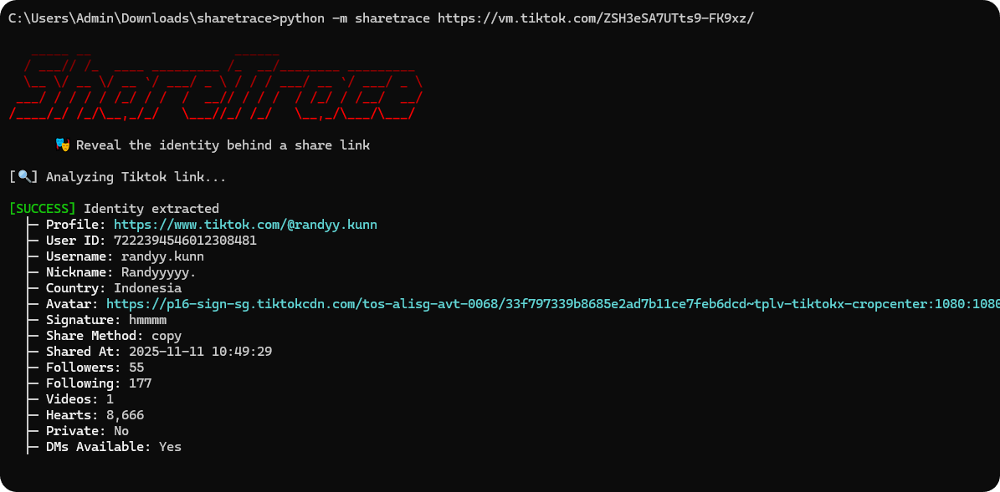

<h1 align="center">ShareTrace</h1>
<p align="center">🎭 Reveal the identity behind a share link</p>
<p align="center"><b>17 sources</b> • no API keys • one command</p>
<p align="center">
  
</p>


## 💻 Quick Start

```bash
python -m sharetrace <url>
```

## 📖 Usage examples

```bash
# Output as JSON for piping
python -m sharetrace <url> --json

# List all supported platforms
python -m sharetrace --list

# TikTok share link — extracts sharer identity + device + share method
python -m sharetrace "https://vm.tiktok.com/<code>"

# ChatGPT share — extracts display name
python -m sharetrace "https://chatgpt.com/share/<uuid>"

# Google Docs / Sheets / Drive — extracts owner email + Google ID + dates
python -m sharetrace "https://docs.google.com/document/d/<id>/edit" --json

# GitHub commit — extracts committer name + email
python -m sharetrace "https://github.com/<user>/<repo>/commit/<sha>"

# GitHub profile — scans recent public PushEvents for emails
python -m sharetrace "https://github.com/<username>"

# GitLab commit — same .patch trick as GitHub
python -m sharetrace "https://gitlab.com/<group>/<project>/-/commit/<sha>"

# Hugging Face profile — extracts full name, followers, orgs
python -m sharetrace "https://huggingface.co/<username>"

# Notion public page — leaks editor names + UUIDs in one POST
python -m sharetrace "https://<workspace>.notion.site/<page>"

# Override the default Google Drive API key (if it gets revoked)
SHARETRACE_GDOC_API_KEY=<your-key> python -m sharetrace <drive-url>
```

## ⚙️ Installation

```bash
git clone https://github.com/soxoj/sharetrace.git
cd sharetrace
pip install -r requirements.txt
```

## Supported sources

| Name                | Extracts | Notes |
| ------------------- | -------- | ----- |
| [TikTok](https://tiktok.com)              | User ID, Username, Nickname, Country, Avatar, Signature, Device, Share Method, Timestamp, Follower/Following/Video/Heart Counts, Private Account, DM Available | Requires short share link (`vm.tiktok.com` / `vt.tiktok.com`) |
| [Instagram](https://instagram.com)        | Username, User ID, Display Name, Profile URL, Profile Pic | Sharer data might expire within a few days; only fresh share links contain identity info |
| [Discord](https://discord.com)            | User ID, Username, Display Name, Avatar, Creation Time | Vanity invites may not contain inviter data |
| [ChatGPT](https://chatgpt.com)            | Display Name | |
| [Claude](https://claude.ai)               | Display Name, User ID | |
| [Perplexity](https://perplexity.ai)       | Username, Avatar, User ID | |
| [Microsoft](https://sharepoint.com)       | Email | From SharePoint/OneDrive personal links; no HTTP request needed |
| [Pinterest](https://pinterest.com)        | Username, User ID, Display Name, Avatar, Profile URL | Requires short share link (`pin.it`) with invite code |
| [Substack](https://substack.com)          | User ID, Name, Handle, Bio, Avatar, Profile Setup Date | Requires referral share link (`?r=` parameter) |
| [Suno](https://suno.com)                  | Username, Display Name, Avatar, Profile URL | |
| [Telegram](https://telegram.org)          | User ID | Decoded from joinchat link hash; no HTTP request needed. Links starting with `AAAAA` decode to user_id=0 and contain no useful data |
| [Google Docs](https://docs.google.com)    | Owner Email, Name, Google ID, Avatar, Creation Date, Last Edit | Works for Docs, Sheets, Slides, Drawings, Forms, Drive files, Apps Script, Jamboard, My Maps. Requires document to be publicly shared. API key overridable via `SHARETRACE_GDOC_API_KEY` |
| [GitHub](https://github.com)              | Email, Name, Commit SHA, Repo (commit URL); Username, Emails list (profile URL) | Commit URL: parses `.patch` mbox `From:` header. Profile URL: scans recent public PushEvents (last 90 days). `users.noreply.github.com` emails flagged. Profile route subject to GitHub's 60/hr unauth rate limit |
| [GitLab](https://gitlab.com)              | Email, Name, Commit SHA, Project (commit URL); Username, Public Email (profile URL) | Same `.patch` mbox trick as GitHub for commits. Profile lookup via `/api/v4/users` returns `public_email` only when the user opted in. Self-hosted GitLab instances out of scope |
| [Hugging Face](https://huggingface.co)    | Username, Full Name, Avatar, Account Type, Followers, Organizations, Profile URL | Uses public `/api/users/<name>/overview` endpoint. Repo URLs (`/<user>/<repo>`) resolve to owner |
| [LinkedIn](https://linkedin.com)          | Display Name, Headline, Avatar, Profile URL | OG-tag scrape with realistic UA. Honestly surfaces `is_blocked: True` on 999/403/429/authwall — block rate dynamic |
| [Notion](https://notion.so)               | Name, Avatar, User ID, Workspace Name/Domain, Other Editors | Public pages leak editor UUIDs in block permissions; resolved in one `syncRecordValuesMain` POST (no auth, no cookies). Works for `notion.so/Page-<uuid>` and `*.notion.site/` links. Notion has started redacting email fields for some accounts |

## 🌐 Web interface (community)

A self-hosted Flask wrapper with a browser UI is available: [voelspriet/sharetrace-web](https://github.com/voelspriet/sharetrace-web) — live demo at <https://share.whopostedwhat.com>. Maintained separately; all extraction logic still lives in this repo.

<p align="center">
  
</p>

## 😊 SOWEL classification
This tool uses the following OSINT techniques:
- [SOTL-1.4. Analyze Internal Identifiers](https://sowel.soxoj.com/internal-identifiers)
- [SOTL-3.1. Extract Metadata From User-Generated Content](https://sowel.soxoj.com/Techniques/SOTL-3.1.+Extract+Metadata+From+User-Generated+Content)

## 🙏 Acknowledgements

- **[Malfrats/xeuledoc](https://github.com/Malfrats/xeuledoc)** by [@mxrch](https://github.com/mxrch) and [@megadose](https://github.com/megadose) — the Google Drive `v2beta` owner-metadata endpoint was first documented here (GPLv3). The `gdoc` module is a clean-room rewrite against the same public API.
- **[avonture.be](https://www.avonture.be/blog/github-retrieve-email/)** by [@cavo789](https://github.com/cavo789) — documented the GitHub `.patch` trick that the `github` module's commit route relies on.
- **Notion editor-leak technique** — public pages expose editor UUIDs in block permissions, resolvable to names/photos via `syncRecordValuesMain` with no auth. Originally discovered by [@SpongeBhav](https://x.com/SpongeBhav/status/2045947981057454571) ([@baibhavanand](https://github.com/baibhavanand) on GitHub) and amplified by [@weezerosint](https://x.com/weezerosint/status/2045849358462222720).

## ⚠️ Ethical use & disclaimer

This tool is created for **educational and defensive purposes only**.

- Only analyze links that have been publicly shared or sent to you.
- Only hit endpoints that are explicitly public (no auth, no scraping of private data).
- The maintainers are not responsible for misuse.

Permitted: journalistic fact-checking, corporate security research, authorized penetration testing, counter-scam / anti-fraud work, personal reputation monitoring.

Forbidden: doxxing, harassment, stalking, unauthorized surveillance, social engineering for fraud, privacy invasion, any criminal activity.
