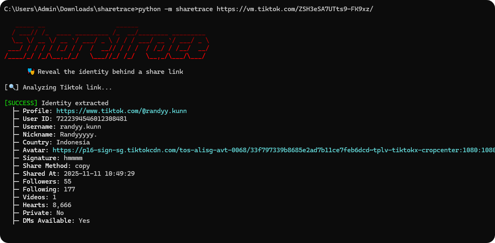

<h1 align="center">ShareTrace</h1>
<p align="center">🎭 Reveal the identity behind a share link</p>
<p align="center"><b>18 sources</b> • no API keys • one command</p>
<p align="center">
  
</p>


## 💻 Quick Start

```bash
pip install sharetrace-osint
sharetrace <url>